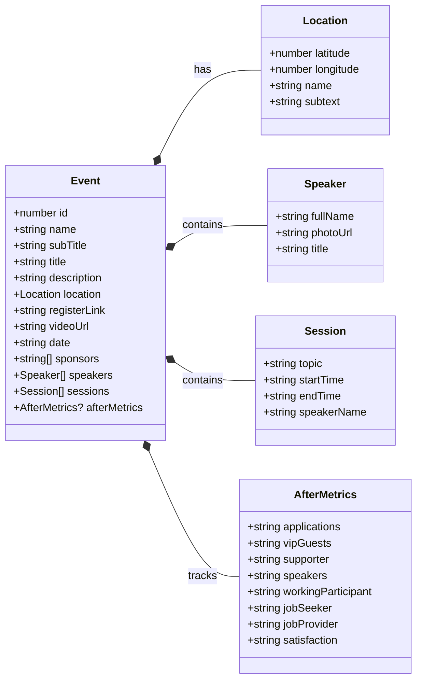

# MultiGroup Event Page

[](https://github.com/chetanraj/awesome-github-badges) [](code_of_conduct.md)  [](https://opensource.org/licenses/MIT) [](https://GitHub.com/Developer-MultiGroup/multigroup-event-page/pulls/) [](https://GitHub.com/Developer-MultiGroup/multigroup-event-page/issues/)

## Overview

This repository is designed to help you easily access Developer MultiGroup's events. You can review previous or upcoming events here, and if you'd like to contribute, you can check out the `issues` section to support us.

[Türkçe Dökümantasyon](/README.md)

## Features

- **Dynamic Structure:** Create and publish new events without the need for any database and storage service.
- **Add to Calendar:** Easily add event sessions to your calendar and stay in the flow.
- **Access Locations:** Easily access the event area with the map application suitable for your platform.
- **Responsive Design:** A fully dynamic design so you can follow our events from every platform.

## Technologies Used

- **Next.js:** User interface development.
- **Shadcn/ui:** Ready-to-use components.
- **Tailwind CSS:** Styling and responsive designs.
- **Pigeon Maps:** Dynamic display of event locations.
- **Vercel:** Code deployment.
- **Framer:** Component and page animations.

## Event File Management

### Event Type Structure



### Photo Folders

```bash
/public/images
    ├── events
    │   └── event-name
    ├── speakers
    └── sponsors
```

The project's photo storage structure is as shown above.

#### Event Photos

Each event has 3 photos with specified names under its own name (slugified name).

#### Speaker Photos

All speaker photos are kept in this folder with slugified names, and when adding a speaker to any event, the photos are automatically taken from this folder when added with that name.

#### Sponsor Photos

The logic for sponsor photos is the same as speakers. Sponsor logos are kept in this folder with a slugified name, and this name is added to the array structure in the event object when needed.

## Creating a New Event

To create a new event, it's sufficient to create a new object in the `data/events.ts` file and write the fields specified above. The only thing to pay attention to is the names of the photos and where they are placed.

## Repo Activity

<!--  -->

[](https://star-history.com/#fDeveloper-MultiGroup/multigroup-event-page)

## License

Check out the [license](LICENSE) of this project.

## Contact

If you have any questions, feel free to reach out to me at `me@furkanunsalan.dev`.
