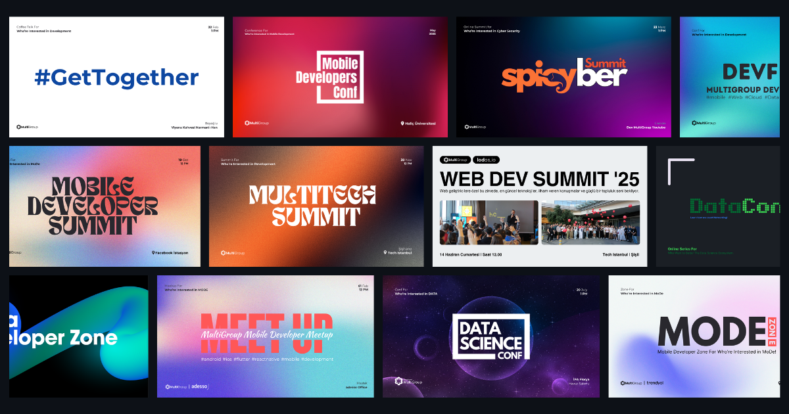
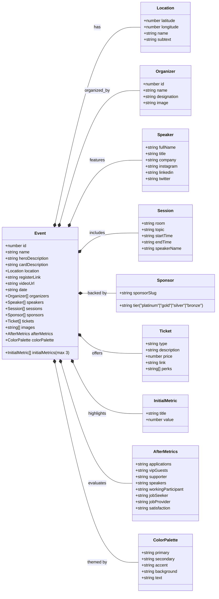
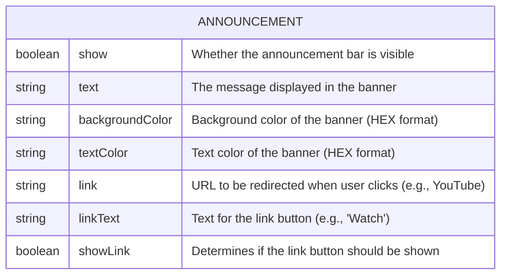

<h1 align="center">MultiGroup Events</h1>

<div align="center">

[](https://github.com/chetanraj/awesome-github-badges)
[](https://kommunity.com/devmultigroup)
[](code_of_conduct.md)
[](https://opensource.org/license/gpl-3-0)
[](https://GitHub.com/Developer-MultiGroup/multigroup-event-page/pulls/)
[](https://GitHub.com/Developer-MultiGroup/multigroup-event-page/issues/)

</div>

## Overview

This repository is designed to easily access the events organized by Developer MultiGroup. You can browse past or upcoming events here, and if you would like to contribute, feel free to check out the `issues` section and support us.

[English Documentation](/README-ENG.md)

## Features

- **Dynamic Structure:** Create and publish new events without the need for a database or storage service.
- **Add to Calendar:** Easily add sessions to your calendar and stay up-to-date.
- **Access Locations:** Reach the event location easily using map applications suitable for your platform.
- **Responsive Design:** Fully dynamic design to follow our events from any device.

## Technologies Used

- **Next.js:** Used for developing the user interface.
- **Shadcn/ui:** Pre-built components used in the project.
- **Tailwind CSS:** Styling and responsive design.
- **Pigeon Maps:** Dynamic display of event locations.
- **Vercel:** Code deployment.
- **Framer:** Component and page animations.

## Project File Management

### Event Type Structure



### Photo Folders

```bash
/public/images
    ├── events
    │   └── event-name
    ├── logo
    ├── mockups
    ├── organizer
    ├── speakers
    └── sponsors
```

The photo storage structure of the project is shown above.

#### Event Photos

Each event has 3 photos under its own slugified name.

#### Logos

Directory where the logos used for MultiGroup are stored.

#### Mockups

Directory where mockups used for events and card designs are stored.

#### Organizer Photos

Directory where photos of event organizers are collected to be used on the landing page.

#### Speaker Photos

All speaker photos are stored here with slugified names. When a speaker is added to an event, the photos are automatically fetched using that name.

#### Sponsor Photos

The logic for sponsor logos is the same as speakers. With a slugified name, sponsor logos are stored in this folder and added to the event object accordingly.

### Component Folders

#### Common Components

(src/components/common)

Components commonly used across the project.

#### Divider Components

(src/components/dividers)

Used in section transitions.

#### Event Components

(src/components/event-components)

Components used in the event page or related to events.

#### Navigation Components

(src/components/navigation-components)

Components specific to navigation.

#### Speaker Components

(src/components/speaker-components)

Components related to speakers.

#### External Components

(src/components/ui)

Components downloaded from external sources like Shadcn UI, Aceternity UI, etc.

### Announcement File

(src/data/announcement.ts)



## Creating a New Event

To create a new event, you need to add a new object that conforms to the Event type mentioned above in the `src/data/events.ts` file. Here are the detailed steps:

### 1. Basic Information

```typescript
{
  id: 3, // Unique ID (must be greater than the highest existing ID)
  name: "Event Name 2025", // Event name must include a year postfix
  heroDescription: "Description that will appear in the hero section of the main page",
  cardDescription: "Short description that will appear on the event card",
  registerLink: "Registration link (Kommunity or other platform)",
  videoUrl: "", // Video link if available
  date: "2025-12-31T13:00:00+03:00", // Date in ISO 8601 format
}
```

### 2. Location Information

```typescript
location: {
  latitude: 41.085660366250444, // Coordinates from Google Maps
  longitude: 28.950240039927138,
  name: "Venue Name",
  subtext: "Detailed address information"
}
```

### 3. Organizers

```typescript
organizers: [
  {
    id: 1,
    name: "Organizer Name",
    designation: "Position",
    image: "/images/organizers/organizer-name.webp", // Slugified name
  },
];
```

### 4. Speakers

```typescript
speakers: [
  {
    fullName: "Speaker Name",
    title: "Title",
    company: "Company Name",
    // Optional social media links:
    // instagram: "username",
    // linkedin: "username",
    // twitter: "username"
  },
];
```

### 5. Sessions

```typescript
sessions: [
  {
    topic: "Session Topic",
    startTime: "13.00", // HH.MM format
    endTime: "13.30",
    speakerName: "Speaker Name",
    room: "Room Name", // "Main Hall", "Side Hall", "Network", etc.
  },
];
```

### 6. Sponsors

```typescript
sponsors: [
  {
    tier: "", // "platinum", "gold", "silver", "bronze" (currently not used)
    sponsorSlug: "sponsor-name", // Slugified sponsor name
  },
];
```

### 7. Tickets

```typescript
tickets: [
  {
    type: "Ticket Type",
    description: "Ticket description",
    price: 300, // Price (TL)
    link: "Ticket purchase link",
    perks: ["Benefit 1", "Benefit 2"],
  },
];
```

### 8. Images

```typescript
images: [
  "/images/events/event-name/1.webp",
  "/images/events/event-name/2.webp",
  "/images/events/event-name/3.webp",
];
```

### 9. Metrics

```typescript
initialMetrics: [
  { title: "Metric Title", value: 100 },
  { title: "Another Metric", value: 50 }
], // Maximum 3 items

// Post-event metrics (optional)
// afterMetrics: {
//   applications: "700",
//   vipGuests: "200+",
//   supporter: "250+",
//   speakers: "40",
//   workingParticipant: "70%",
//   jobSeeker: "45%",
//   jobProvider: "75%",
//   satisfaction: "90%"
// }
```

### 10. Color Palette

```typescript
colorPalette: {
  primary: "162, 85%, 96%", // In HSL format
  secondary: "160, 8%, 17%",
  accent: "168, 70%, 75%",
  background: "0, 0%, 100%",
  text: "250, 6.98%, 16.86%"
}
```

### Important Notes:

- **Photo Naming:** All photos should be saved with slugified names
- **File Formats:** Photos should be in `.webp` format
- **Folder Structure:** Event photos should be stored in `/public/images/events/event-name/` folder
- **Speaker Photos:** Should be stored in `/public/images/speakers/` folder with slugified names
- **Sponsor Logos:** Should be stored in `/public/images/sponsors/` folder with slugified names
- **Organizer Photos:** Should be stored in `/public/images/organizers/` folder

### Example Usage:

You can refer to the examples in the `src/data/events.ts` file to examine the structure of existing events.

## Repo Activity

<!--  -->

[](https://star-history.com/#fDeveloper-MultiGroup/multigroup-event-page)

## License

Check out this project's [license](LICENSE).

## Contact

If you have any questions about the project, you can contact me via email at `me@furkanunsalan.dev`.

Let me know if you'd like this in a separate file or with any formatting changes!

## Event Banner Image Feature

- Event cards now display a responsive banner image on the right (desktop) or after the tags (on mobile).
- The image is loaded from `/public/images/banners/{event-slug}-{year}.webp`, where `event-slug` is the slugified event name without the year, and `year` is the latest available.
- Place your banner images in this folder and name them accordingly. For example: `mobile-developer-conference-2025.webp`.
