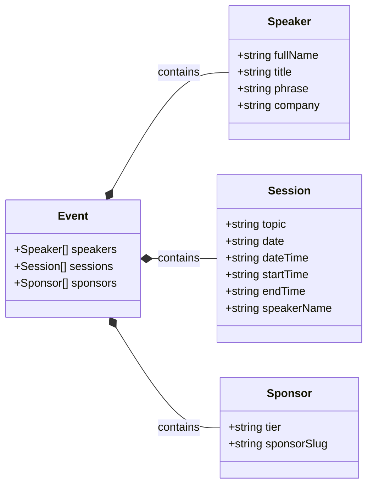

# DMG Bootcamp | Generative AI Fundamentals with Gemini
[](https://github.com/chetanraj/awesome-github-badges) [](https://opensource.org/licenses/MIT) [](https://GitHub.com/Developer-MultiGroup/multigroup-event-page/pulls/) [](https://GitHub.com/Developer-MultiGroup/multigroup-event-page/issues/)

## Overview

This repository is designed to provide easy access to Developer MultiGroup's events. You can explore past or upcoming events here, and if you'd like to contribute, you can check out the `issues` section to support us.

[Türkçe Dokümantasyon](/README.md)

Also check out our [Data Science Awesome Repo](https://github.com/Developer-MultiGroup/DMG-Data-Science-Awesome) for more resources!

## Features

- **Dynamic Structure:** Create and publish new events without requiring any database or storage service
- **Add to Calendar:** Easily add event sessions to your calendar and stay in the loop
- **Access Locations:** Reach event venues easily with your platform's preferred map application
- **Responsive Design:** A fully dynamic design to follow our events from any platform

## Technologies Used

- **Next.js:** User interface development
- **Shadcn/ui:** Pre-built components
- **Tailwind CSS:** Styling and responsive designs
- **Vercel:** Code deployment
- **Framer:** Component and page animations

## Installation Instructions

### Prerequisites

- Node.js (version 16.x or later)
- npm or yarn

### Running Locally

```bash
$ git clone https://github.com/Developer-MultiGroup/multigroup-event-page.git
$ cd multigroup-event-page
$ git branch genai-fund
$ npm install
$ npm run dev
```

Visit `http://localhost:3000` in your browser to see the development version.

## Event File Management

### Event Type Structure



### Photo Directories

```bash
/public/images
    ├── speakers
    └── sponsors
```

The project's photo storage structure is as shown above.

#### Speaker Photos

All speaker photos are stored in this directory with slugified names. When adding a speaker to any event, photos are automatically retrieved from this directory when added with that name.

#### Sponsor / Company Photos

The logic for sponsor photos is the same as speakers. Sponsor logos are kept in this directory with a slugified name, and this name is added to the array structure in the event object when needed.

## Contributing

After setting up the project in your local environment by following the [installation instructions](#installation-instructions), you can make any changes you want and fix any bugs by sending a `Pull Request`. Follow these steps to send a PR:

1. **Create a `Fork` of the project**

2. **Create a new `Branch`**

    ```bash
    git checkout -b feature/your-feature
    # or
    git checkout -b fix/your-fix
    ```

3. **Make your changes**

4. **Commit your changes**

    ```bash
    git add .
    git commit -m "feat: Add a descriptive commit message"
    # or 
    git commit -m "fix: Add a descriptive commit message"
    ```

5. **Push your changes to the `Repository`**

    ```bash
    git push origin feature/your-feature
    ```

6. **Open a `Pull Request`**
    Create a PR from your own `Fork` of this project to the main `Repository` in your profile

## Repo Activity

<!--  -->

[](https://star-history.com/#fDeveloper-MultiGroup/multigroup-event-page)

## License
Check out the project's [license](LICENSE).

## Contact
If you have any questions, feel free to reach out to me at `me@furkanunsalan.dev`.