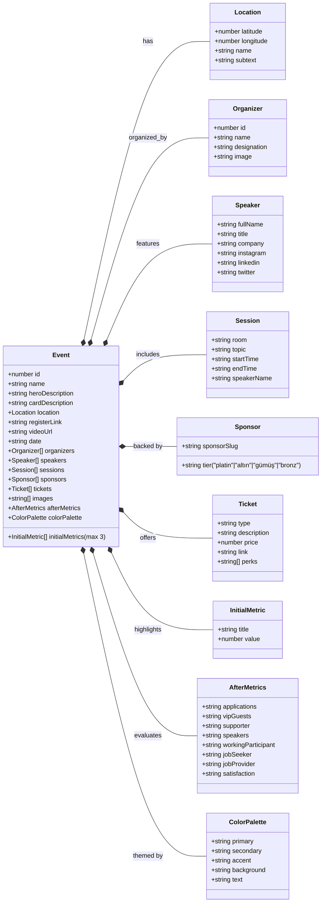
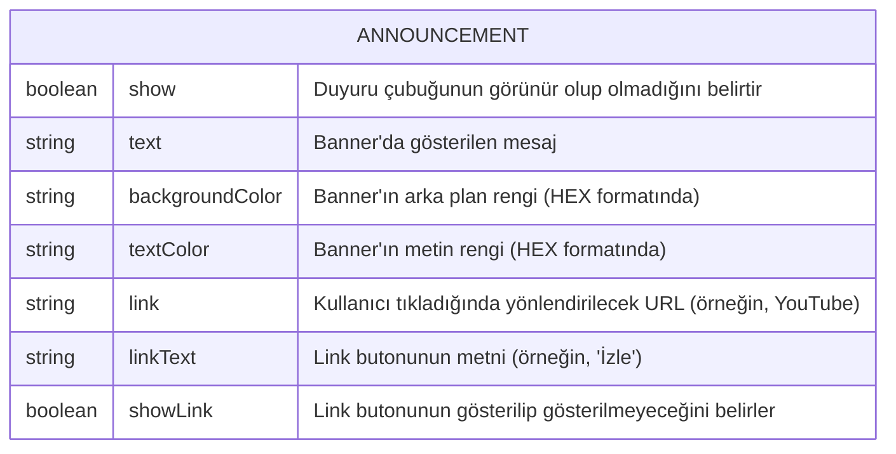

<h1 align="center">MultiGroup Etkinlikleri</h1>

<div align="center">

[](https://github.com/chetanraj/awesome-github-badges)
[](https://kommunity.com/devmultigroup)
[](code_of_conduct.md)
[](https://opensource.org/license/gpl-3-0)
[](https://GitHub.com/Developer-MultiGroup/multigroup-event-page/pulls/)
[](https://GitHub.com/Developer-MultiGroup/multigroup-event-page/issues/)

</div>

## Genel Bakış

Bu repository Developer MultiGroup'un etkinliklerine kolayca ulaşabilmeniz için tasarlandı. Daha önceden yapılmış veya en yakın zamanda yapılacak olan etkinlikleri buradan inceleyebilir, katkıda bulunmak isterseniz `issues` kısmına göz atarak bizlere destek olabilirsiniz.

[English Documentation](/README-ENG.md)

## Özellikler

- **Dinamik Yapı:** Hiçbir veritabanı ve depolama servisine gerek duymadan yeni etkinlikler oluşturun ve yayınlayın
- **Takvime Ekle:** Etkinlik oturumlarını takviminize kolayca ekleyin ve akıştan geri kalmayın.
- **Konumlara Erişin:** Platformunuza uygun harita uygulaması ile etkinlik alanına kolayca ulaşın.
- **Duyarlı Tasarım:** Etkinliklerimizi her platformdan takip edebilmeniz için tamamen dinamik bir tasarım.

## Kullanılan Teknolojiler

- **Next.js:** Kullanıcı arayüzünün geliştirilmesi.
- **Shadcn/ui:** Kullanılan hazır bileşenler (components).
- **Tailwind CSS:** Stil ve cihaza duyarlı tasarımlar.
- **Pigeon Maps:** Etkinlik lokasyonlarının dinamik şekilde gösterilmesi.
- **Vercel:** Kod dağıtımı.
- **Framer:** Bileşen ve sayfa animasyonları.

## Proje Dosyalarının Yönetimi

### Event Type Yapısı



### Fotoğraf Klasörleri

```bash
/public/images
    ├── events
    │   └── event-name
    ├── logo
    ├── mockups
    ├── organizer
    ├── speakers
    └── sponsors
```

Projenin fotoğraf depolama yapısı yukarıdaki gibidir.

#### Etkinlik Fotoğrafları

Her etkinliğin kendisiyle alakalı 3 adet fotoğraf belirtilen isimlerde kendi isminin altında (slugify edilmiş isim) bulunur.

#### Logolar

MultiGroup adına kullanılan logoların depolandığı dosya dizinidir.

#### Mockup'lar

Etkinlikler özelinde ve kart tasarımlarında kullanılan mockup'ların biriktirildiği dizindir.

#### Organizatör Fotoğrafları

Etkinlik organizatörlerinin giriş sayfasında kullanılmak üzere toplanan fotoğraflarının bulunduğu dosya dizini.

#### Konuşmacı Fotoğrafları

Tüm konuşmacıların fotoğrafları slugify edilmiş isimler ile bu klasörde tutulur ve herhangi bir etkinliğe konuşmacı eklenirken o isimle eklendiğinde fotoğraflar otomatik olarak bu klasörden alınır

#### Sponsor Fotoğrafları

Sponsor fotoğraflarının mantığı da konuşmacılarla aynıdır. Slugify edilmiş bir isim ile sponsorların logoları bu klasörün içerisinde tutulur ve gerektiğinde etkinlik objesindeki array yapısına bu isim eklenir.

### Component Klasörleri

#### Ortak Bileşenler

(src/components/common)

Diğer bileşenlerde ortak olarak kullanılan, proje genelinde ihtiyaç duyulan bileşenler.

#### Ayırıcı Bileşenler

(src/components/dividers)

Bölüm geçişlerinde kullanılan bileşenler.

#### Etkinlik Bileşenleri

(src/components/event-components)

Etkinlik sayfasında kullanılan veya etkinliklerle ilgili bileşenler.

#### Navigation Bileşenleri

(src/components/navigation-components)

Navigasyon özelinde kullanılan bileşenler.

#### Konuşmacı Bileşenleri

(src/components/speaker-components)

Konuşmacılar ile alakalı olarak kullanılan bileşenler

#### Harici Bileşenler

(src/components/ui)

Shadcn UI, Aceternity UI gibi harici kaynaklardan indirilen bileşenler.

### Duyuru Dosyası

(src/data/announcement.ts)



## Yeni Etkinlik Oluşturma

Yeni bir etkinlik oluşturmak için `src/data/events.ts` dosyasında yukarıda belirtilen Event tipine uygun bir obje oluşturmanız yeterlidir. İşte detaylı adımlar:

### 1. Temel Bilgiler

```typescript
{
  id: 3, // Benzersiz ID (mevcut en yüksek ID'den büyük olmalı)
  name: "Etkinlik Adı 2025", // Etkinlik ismi mutlaka yıl post-fix'i içermelidir
  heroDescription: "Ana sayfa hero bölümünde görünecek açıklama",
  cardDescription: "Etkinlik kartında görünecek kısa açıklama",
  registerLink: "Kayıt linki (Kommunity veya başka platform)",
  videoUrl: "", // Varsa video linki
  date: "2025-12-31T13:00:00+03:00", // ISO 8601 formatında tarih
}
```

### 2. Konum Bilgileri

```typescript
location: {
  latitude: 41.085660366250444, // Google Maps'ten alınan koordinat
  longitude: 28.950240039927138,
  name: "Mekan Adı",
  subtext: "Detaylı adres bilgisi"
}
```

### 3. Organizatörler

```typescript
organizers: [
  {
    id: 1,
    name: "Organizatör Adı",
    designation: "Pozisyon",
    image: "/images/organizers/organizator-adi.webp", // Slugify edilmiş isim
  },
];
```

### 4. Konuşmacılar

```typescript
speakers: [
  {
    fullName: "Konuşmacı Adı",
    title: "Ünvan",
    company: "Şirket Adı",
    // Opsiyonel sosyal medya linkleri:
    // instagram: "kullanici_adi",
    // linkedin: "kullanici_adi",
    // twitter: "kullanici_adi"
  },
];
```

### 5. Oturumlar

```typescript
sessions: [
  {
    topic: "Oturum Konusu",
    startTime: "13.00", // HH.MM formatında
    endTime: "13.30",
    speakerName: "Konuşmacı Adı",
    room: "Salon Adı", // "Ana Salon", "Yan Salon", "Network" vb.
  },
];
```

### 6. Sponsorlar

```typescript
sponsors: [
  {
    tier: "", // "platin", "altın", "gümüş", "bronz" (şu an kullanılmıyor)
    sponsorSlug: "sponsor-adi", // Slugify edilmiş sponsor adı
  },
];
```

### 7. Biletler

```typescript
tickets: [
  {
    type: "Bilet Türü",
    description: "Bilet açıklaması",
    price: 300, // Fiyat (TL)
    link: "Bilet satın alma linki",
    perks: ["Avantaj 1", "Avantaj 2"],
  },
];
```

### 8. Görseller

```typescript
images: [
  "/images/events/etkinlik-adi/1.webp",
  "/images/events/etkinlik-adi/2.webp",
  "/images/events/etkinlik-adi/3.webp",
];
```

### 9. Metrikler

```typescript
initialMetrics: [
  { title: "Metrik Başlığı", value: 100 },
  { title: "Başka Metrik", value: 50 }
], // Maksimum 3 adet

// Etkinlik sonrası metrikler (opsiyonel)
// afterMetrics: {
//   applications: "700",
//   vipGuests: "200+",
//   supporter: "250+",
//   speakers: "40",
//   workingParticipant: "70%",
//   jobSeeker: "45%",
//   jobProvider: "75%",
//   satisfaction: "90%"
// }
```

### 10. Renk Paleti

```typescript
colorPalette: {
  primary: "162, 85%, 96%", // HSL formatında
  secondary: "160, 8%, 17%",
  accent: "168, 70%, 75%",
  background: "0, 0%, 100%",
  text: "250, 6.98%, 16.86%"
}
```

### Önemli Notlar:

- **Fotoğraf İsimlendirmesi:** Tüm fotoğraflar slugify edilmiş isimlerle kaydedilmelidir
- **Dosya Formatları:** Fotoğraflar `.webp` formatında olmalıdır
- **Klasör Yapısı:** Etkinlik fotoğrafları `/public/images/events/etkinlik-adi/` klasöründe saklanmalıdır
- **Konuşmacı Fotoğrafları:** `/public/images/speakers/` klasöründe slugify edilmiş isimlerle saklanmalıdır
- **Sponsor Logoları:** `/public/images/sponsors/` klasöründe slugify edilmiş isimlerle saklanmalıdır
- **Organizatör Fotoğrafları:** `/public/images/organizers/` klasöründe saklanmalıdır

### Örnek Kullanım:

Mevcut etkinliklerin yapısını incelemek için `src/data/events.ts` dosyasındaki örnekleri referans alabilirsiniz.

## Repo Aktivitesi

<!--  -->

[](https://star-history.com/#fDeveloper-MultiGroup/multigroup-event-page)

## Lisans

Bu projenin [lisansına](LICENSE) göz atın.

## İletişim

Eğer proje hakkında herhangi bir sorunuz olursa bana `me@furkanunsalan.dev` mail adresi üzerinden ulaşabilirsiniz.
