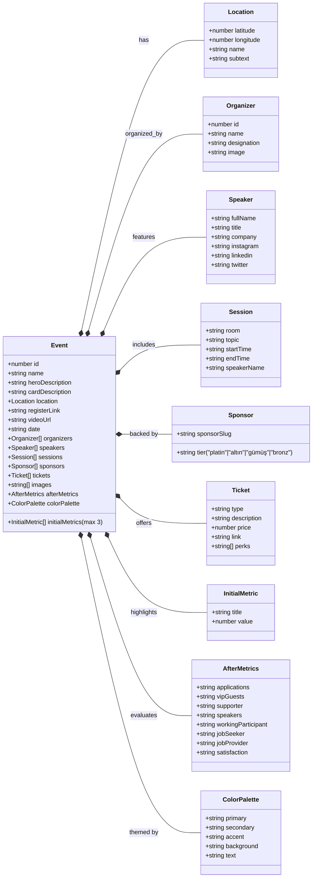
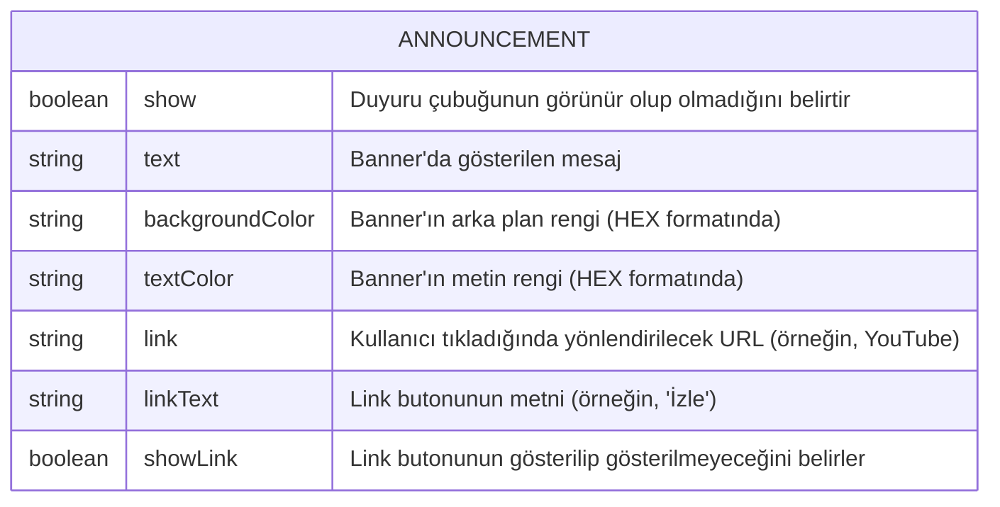

<h1 align="center">MultiGroup Etkinlikleri</h1>

<div align="center">

[](https://github.com/chetanraj/awesome-github-badges)
[](https://kommunity.com/devmultigroup)
[](code_of_conduct.md)
[](https://opensource.org/license/gpl-3-0)
[](https://GitHub.com/Developer-MultiGroup/multigroup-event-page/pulls/)
[](https://GitHub.com/Developer-MultiGroup/multigroup-event-page/issues/)

</div>

## Genel Bakış

Bu repository Developer MultiGroup'un etkinliklerine kolayca ulaşabilmeniz için tasarlandı. Daha önceden yapılmış veya en yakın zamanda yapılacak olan etkinlikleri buradan inceleyebilir, katkıda bulunmak isterseniz `issues` kısmına göz atarak bizlere destek olabilirsiniz.

[English Documentation](/README-ENG.md)

## Özellikler

- **Dinamik Yapı:** Hiçbir veritabanı ve depolama servisine gerek duymadan yeni etkinlikler oluşturun ve yayınlayın
- **Takvime Ekle:** Etkinlik oturumlarını takviminize kolayca ekleyin ve akıştan geri kalmayın.
- **Konumlara Erişin:** Platformunuza uygun harita uygulaması ile etkinlik alanına kolayca ulaşın.
- **Duyarlı Tasarım:** Etkinliklerimizi her platformdan takip edebilmeniz için tamamen dinamik bir tasarım.

## Kullanılan Teknolojiler

- **Next.js:** Kullanıcı arayüzünün geliştirilmesi.
- **Shadcn/ui:** Kullanılan hazır bileşenler (components).
- **Tailwind CSS:** Stil ve cihaza duyarlı tasarımlar.
- **Pigeon Maps:** Etkinlik lokasyonlarının dinamik şekilde gösterilmesi.
- **Vercel:** Kod dağıtımı.
- **Framer:** Bileşen ve sayfa animasyonları.

## Proje Dosyalarının Yönetimi

### Event Type Yapısı



### Fotoğraf Klasörleri

```bash
/public/images
    ├── events
    │   └── event-name
    ├── logo
    ├── mockups
    ├── organizer
    ├── speakers
    └── sponsors
```

Projenin fotoğraf depolama yapısı yukarıdaki gibidir.

#### Etkinlik Fotoğrafları

Her etkinliğin kendisiyle alakalı 3 adet fotoğraf belirtilen isimlerde kendi isminin altında (slugify edilmiş isim) bulunur.

#### Logolar

MultiGroup adına kullanılan logoların depolandığı dosya dizinidir.

#### Mockup'lar

Etkinlikler özelinde ve kart tasarımlarında kullanılan mockup'ların biriktirildiği dizindir.

#### Organizatör Fotoğrafları

Etkinlik organizatörlerinin giriş sayfasında kullanılmak üzere toplanan fotoğraflarının bulunduğu dosya dizini.

#### Konuşmacı Fotoğrafları

Tüm konuşmacıların fotoğrafları slugify edilmiş isimler ile bu klasörde tutulur ve herhangi bir etkinliğe konuşmacı eklenirken o isimle eklendiğinde fotoğraflar otomatik olarak bu klasörden alınır

#### Sponsor Fotoğrafları

Sponsor fotoğraflarının mantığı da konuşmacılarla aynıdır. Slugify edilmiş bir isim ile sponsorların logoları bu klasörün içerisinde tutulur ve gerektiğinde etkinlik objesindeki array yapısına bu isim eklenir.

### Component Klasörleri

#### Ortak Bileşenler

(src/components/common)

Diğer bileşenlerde ortak olarak kullanılan, proje genelinde ihtiyaç duyulan bileşenler.

#### Ayırıcı Bileşenler

(src/components/dividers)

Bölüm geçişlerinde kullanılan bileşenler.

#### Etkinlik Bileşenleri

(src/components/event-components)

Etkinlik sayfasında kullanılan veya etkinliklerle ilgili bileşenler.

#### Navigation Bileşenleri

(src/components/navigation-components)

Navigasyon özelinde kullanılan bileşenler.

#### Konuşmacı Bileşenleri

(src/components/speaker-components)

Konuşmacılar ile alakalı olarak kullanılan bileşenler

#### Harici Bileşenler

(src/components/ui)

Shadcn UI, Aceternity UI gibi harici kaynaklardan indirilen bileşenler.

### Duyuru Dosyası

(src/data/announcement.ts)



## Yeni Etkinlik Oluşturma

Yeni bir etkinlik oluştururken yukarında belirtilen alanları `data/events.ts` dosyasında yeni bir obje oluşturup yazmak yeterlidir. Sadece dikkat edilmesi gerek konu fotoğrafların isimleri ve koyuldukları yerlerdir.

## Repo Aktivitesi

<!--  -->

[](https://star-history.com/#fDeveloper-MultiGroup/multigroup-event-page)

## Lisans

Bu projenin [lisansına](LICENSE) göz atın.

## İletişim

Eğer proje hakkında herhangi bir sorunuz olursa bana `me@furkanunsalan.dev` mail adresi üzerinden ulaşabilirsiniz.
