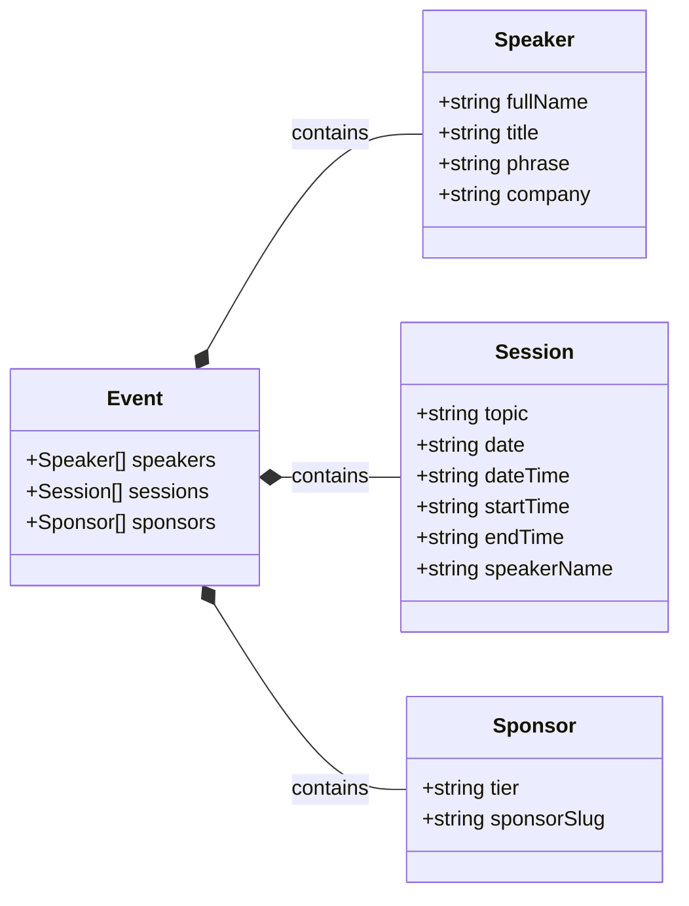

# DMG Bootcamp | Generative AI Fundamentals with Gemini
[](https://github.com/chetanraj/awesome-github-badges) [](https://opensource.org/licenses/MIT) [](https://GitHub.com/Developer-MultiGroup/multigroup-event-page/pulls/) [](https://GitHub.com/Developer-MultiGroup/multigroup-event-page/issues/)

## Genel Bakış

Bu repository Developer MultiGroup'un etkinliklerine kolayca ulaşabilmeniz için tasarlandı. Daha önceden yapılmış veya en yakın zamanda yapılacak olan etkinlikleri buradan inceleyebilir, katkıda bulunmak isterseniz `issues` kısmına göz atarak bizlere destek olabilirsiniz.

[English Documentation](/README-ENG.md)

Ayrıca daha fazla kaynak için [Data Science Awesome Repo'muzu] da ziyeret etmeyi unutmayın!

## Özellikler

- **Dinamik Yapı:** Hiçbir veritabanı ve depolama servisine gerek duymadan yeni etkinlikler oluşturun ve yayınlayın
- **Takvime Ekle:** Etkinlik oturumlarını takviminize kolayca ekleyin ve akıştan geri kalmayın.
- **Konumlara Erişin:** Platformunuza uygun harita uygulaması ile etkinlik alanına kolayca ulaşın.
- **Duyarlı Tasarım:** Etkinliklerimizi her platformdan takip edebilmeniz için tamamen dinamik bir tasarım.

## Kullanılan Teknolojiler

- **Next.js:** Kullanıcı arayüzünün geliştirilmesi.
- **Shadcn/ui:** Kullanılan hazır bileşenler (components).
- **Tailwind CSS:** Stil ve cihaza duyarlı tasarımlar.
- **Vercel:** Kod dağıtımı.
- **Framer:** Bileşen ve sayfa animasyonları.

## Kurulum Talimatları

### Ön Gereklilikler

- Node.js (version 16.x or later)
- npm or yarn

### Lokal Ortamda Çalıştırma

```bash
$ git clone https://github.com/Developer-MultiGroup/multigroup-event-page.git
$ cd multigroup-event-page
$ git branch genai-fund
$ npm install
$ npm run dev
```

Geliştirme versiyonunu görmek için tarayıcınızda `http://localhost:3000` adresine gidin.

## Etkinlik Dosyalarının Yönetimi

### Event Type Yapısı



### Fotoğraf Klasörleri

```bash
/public/images
    ├── speakers
    └── sponsors
```

Projenin fotoğraf depolama yapısı yukarıdaki gibidir. 

#### Konuşmacı Fotoğrafları

Tüm konuşmacıların fotoğrafları slugify edilmiş isimler ile bu klasörde tutulur ve herhangi bir etkinliğe konuşmacı eklenirken o isimle eklendiğinde fotoğraflar otomatik olarak bu klasörden alınır

#### Sponsor / Şirket Fotoğrafları

Sponsor fotoğraflarının mantığı da konuşmacılarla aynıdır. Slugify edilmiş bir isim ile sponsorların logoları bu klasörün içerisinde tutulur ve gerektiğinde etkinlik objesindeki array yapısına bu isim eklenir.

## Contributing

[Kurulum talimatları](#kurulum-talimatları)'ndaki aşamaları uygulayarak projeyi lokal ortamınızda ayağa kaldırdıktan sonra istediğiniz değişiklikleri yapabilir ve istediğiniz hataları düzelterek `Pull Request` gönderebilirsiniz. PR göndermek için aşağıdaki adımları takip edin:

1. **Projenin bir `Fork`'unu oluşturun**

2. **Yeni bir `Branch` oluşturun**

    ```bash
    git checkout -b feature/your-feature
    # or
    git git checkout -b fix/your-fix
    ```

3. **Değişikliklerinizi yapın**

4. **Değişikliklerinizi `Commit` olarak gönderin**

    ```bash
    git add .
    git commit -m "feat: Add a descriptive commit message"
    # or 
    git commit -m "fix: Add a descriptive commit message"
    ```

5. **Değişikliklerinizi `Repository`'ye yollayın**

    ```bash
    git push origin feature/your-feature
    ```

6. **`Pull Request` açın**
    Profilinizdeki bu projenin kendi `Fork`'undan ana `Repository`'ye bir PR oluşturun

## Repo Aktivitesi

<!--  -->

[](https://star-history.com/#fDeveloper-MultiGroup/multigroup-event-page)

## License
Bu projenin [lisansına](LICENSE) göz atın.
## Contact
If you have any questions, feel free to reach out to me at `me@furkanunsalan.dev`.
